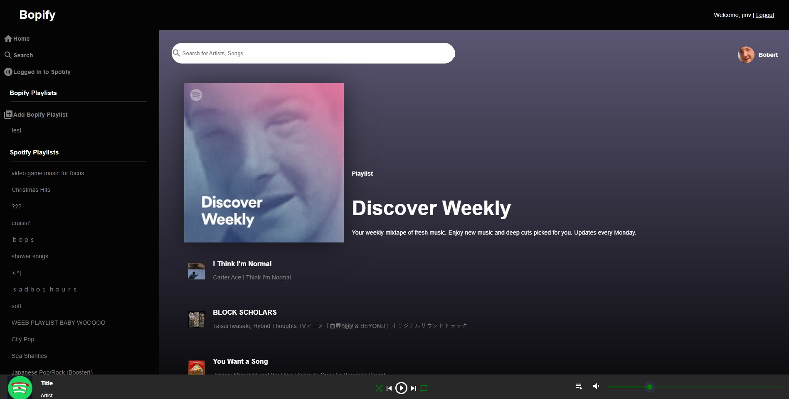

# Bopify

This repo is the React frontend of a productivity tracker. This personal project utilizes the Spotify and YouTube API to pull user information/use their search functions to find songs. Frontend was built with React and CSS styling done with MaterialUI. To see Rails backend [click here](https://github.com/jamave-bot/Bopify-backend).



## Features
* Live site [here](https://bopify.netlify.app/)
* See demo [here](https://youtu.be/YQp4o6n0aO4)
* User can create custom playlists using sources from both YouTube and Spotify with just their shareable song links.
* User can parse through their curated Spotify playlists to find their favorite songs' links. 
* User can search for YouTube videos in the Search section to get video links.
* User can listen to songs from both websites in one playlist. 

## Installation and Setup
Below are instructions to view the application on your machine. Instructions assume you have React installed.

1. Install dependencies 
```
npm install
```
2. Launch React
```
npm start
```

## Inspiration
Project was inspired by wanting a single place to play music from multiple sources without having to switch between websites. 

## Licensing, Feedback, and Questions
* Project is maintained by me
* Feel free to give feedback or ask questions
* Licensing info – at this time this project is not intended to be open sourced and project is not authorized for reuse